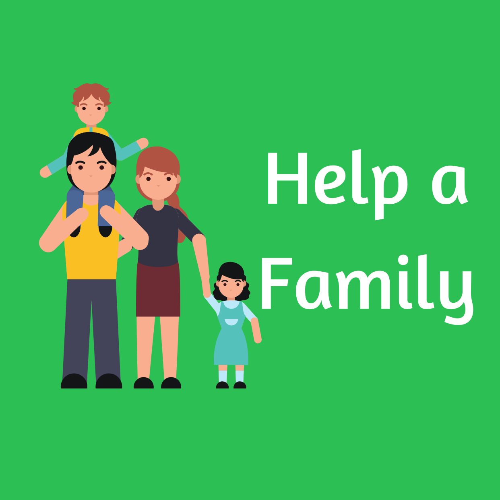
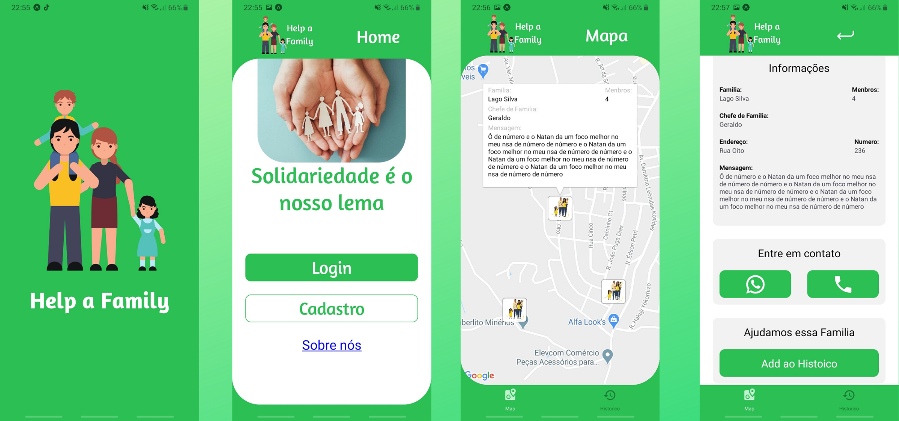

<h1 align="center">
    
</h1>

<h4 align="center">
  🚀 Help a Family
</h4>

  <a href="#rocket-tecnologias">Tecnologias</a>&nbsp;&nbsp;&nbsp;|&nbsp;&nbsp;&nbsp;
  <a href="#-projeto">Projeto</a>&nbsp;&nbsp;&nbsp;|&nbsp;&nbsp;&nbsp;
  <a href="#-video-do-projeto">Video</a>&nbsp;&nbsp;&nbsp;|&nbsp;&nbsp;&nbsp;
  <a href="#-contato">Contato</a>

 

  

## :rocket: Tecnologias

Esse projeto foi desenvolvido utilizando:

- [Node.js](https://nodejs.org/en/)
- [Express](https://expressjs.com/pt-br/)
- [Sequelize](https://sequelize.org/v5/)
- [MySQL](https://www.mysql.com/)
- [Socket.io](https://socket.io/docs)
- [React Native](https://facebook.github.io/react-native/)
- [Expo](https://expo.io/)
- [React Navigation](https://reactnavigation.org/)
- [Styled Components](https://styled-components.com/)
- [Axios](https://github.com/axios/axios)
- [Socket.io-client](https://socket.io/docs/client-api/)

## 💻 Projeto

O Help a Famly é um projeto que visa posibilitar que entidades de ajudas sociais possam ver as localidades onde há familias que necessitam de ajuda e possam entrar em contato com a familia para ajuda-los.

## Video do Projeto

Neste video explico melhor sobre o app e o intuito

- [Video no Instagram]()

## 📧 Contato

- Email: natan.miranda02@gmail.com
- [Linkdin](https://www.linkedin.com/in/natan-bezerra-de-miranda-0b4b93180/)
- [Instagram](https://www.instagram.com/neitan_miranda02/)

---

Feito com ♥ by Natan Bezerra de Miranda :wave: